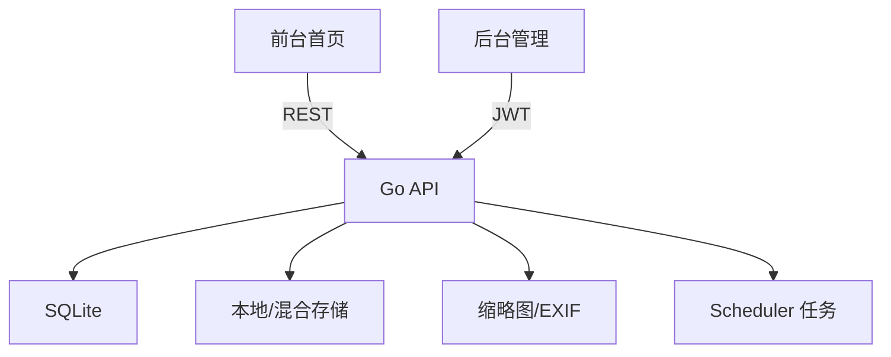

# LitePic（Go 版）定制需求与开发文档 v1.1.0

**Windows 开发 · Docker 部署 · Node + Go**  
**前台仅首页 · 后台七页（仪表盘 / 图片管理 / 相册管理 / 标签管理 / 分享管理 / 系统设置 / 个人资料）**  
**深色主题 + 冷色中性色 · 首页标签筛选 + 300×200 瀑布流 + Lightbox**

> 本定制文档基于你提供的 **v1.0.1** 文档裁剪与增补而成（仅保留所需页面与能力；扩展了 300×200/1200×800 缩略图与 Windows/Docker 说明）。

---

## 目录

- [1. 项目概述与范围](#1-项目概述与范围)
- [2. 设计目标与界面风格](#2-设计目标与界面风格)
- [3. 术语与名词](#3-术语与名词)
- [4. 功能需求（SRS）](#4-功能需求srs)
- [5. 非功能需求（NFR）](#5-非功能需求nfr)
- [6. 系统架构与数据模型](#6-系统架构与数据模型)
- [7. API 设计（公开 / 后台）](#7-api-设计公开--后台)
- [8. 前端实现规范（Vue3）](#8-前端实现规范vue3)
- [9. 后端实现规范（Go）](#9-后端实现规范go)
- [10. Windows 开发环境与启动](#10-windows-开发环境与启动)
- [11. Docker 部署（Compose + Nginx 反代）](#11-docker-部署compose--nginx-反代)
- [12. 目录结构与命名约定](#12-目录结构与命名约定)
- [13. 安全策略与运维](#13-安全策略与运维)
- [14. 验收标准与测试清单](#14-验收标准与测试清单)
- [15. 变更记录](#15-变更记录)

---

## 1. 项目概述与范围

- **定位**：轻量自托管图床（Go 后端 + Vue3 前端）。  
- **此定制版范围**：
  - **前台**：仅保留 **首页**，提供标签筛选 + **300×200 固定卡片瀑布流** + **Lightbox** 弹层预览，点击卡片不跳转路由。  
  - **后台**：仅保留 **仪表盘 / 图片管理 / 相册管理（前端名 Album，后端沿用 Category）/ 标签管理 / 分享管理 / 系统设置 / 个人资料** 七个页面。  
- **从 v1.0.1 移除**：分类页、标签页、搜索页、单图路由预览页、公开分享页等前台路由。  
- **与 v1.0.1 保持一致**：上传（分片/断点续传/秒传）、缩略图生成、EXIF 清理、热度统计、分享机制、任务调度、Prometheus `/metrics`、`/debug/pprof` 等后端能力与基础约定。

---

## 2. 设计目标与界面风格

- **主题基调**：深色主题，**冷色中性色**为主，以凸显图片色彩与光影细节，控件色不过度吸睛。  
- **信息架构**：公开端仅 1 页（首页），后台 7 页。  
- **响应式**：≥1440px 5–6 列；≥1024px 4 列；≥768px 3 列；<768px 2 列。  
- **动效**：卡片轻微放大 `scale(1.02)` + 阴影，标签切换/主题过渡 ≤ 200ms。

**设计令牌（Design Tokens）建议**：
```css
:root {
  --bg-0:#0f1115; --bg-1:#141821; --line:#232936;
  --text-1:#e6e9ef; --text-2:#a3a7ad;
  --brand-1:#4aa3ff; --brand-1-hover:#6bb7ff;
  --card-bg:#11151c; --card-hover:#16202b;
  --chip-bg:#1a2230; --chip-on:#24405a;
}
```

---

## 3. 术语与名词

- **图片（Image）**：单个媒体及其元数据/派生图。  
- **相册（Album）**：UI 名称；后端数据库沿用 `Category` 命名（避免迁移）。  
- **标签（Tag）**：多对多分类，支持合并与计数。  
- **分享（Share）**：对图片/相册生成分享码（可配置密码与有效期）。  
- **缩略图（Thumbnail）**：新增 **300×200**（首页卡片）与 **1200×800**（Lightbox），皆为中心裁剪（cover）。

---

## 4. 功能需求（SRS）

### 4.1 前台 · 首页（唯一公开页）
- **导航**：LOGO、标签筛选（Chips，多选，可隐藏主题切换或仅保留 Dark）。  
- **列表**：瀑布流卡片，**固定 300×200**，`object-fit: cover`，懒加载与骨架屏；无限滚动（滚动至 70% 高度触发下一页）。  
- **筛选**：URL 同步 `?tags=t1,t2&page=1&page_size=60&sort=created_at_desc`。  
- **预览**：点击卡片 → **Lightbox**（页内弹层），左右切换、缩放、复制链接/复制 Markdown、下载；不改变路由。  
- **分享兼容**：URL 带 `share=CODE` 时，若分享有密码需先验证，通过后在 Lightbox 中呈现分享集内容。

### 4.2 后台（需登录）
1. **仪表盘**：总图数、当日上传、热门 TOP、存储占用、任务状态等。  
2. **图片管理**：上传/编辑/删除（默认软删，可硬删）、批量打标签、移动相册、重建缩略图、筛选（相册/标签/时间/状态）。  
3. **相册管理（Album）**：名称、描述、封面、可见性、排序。  
4. **标签管理**：增删改、**合并**与计数。  
5. **分享管理**：生成分享（单图/多图/相册）、密码/有效期、统计、禁用/失效。  
6. **系统设置**：站点信息、**缩略图规格（300×200、1200×800）**、上传限制、白名单、存储策略（本地/GitHub/混合）、CDN 基础 URL、热度衰减开关等。  
7. **个人资料**：头像、昵称、密码修改、个人 Token。  

### 4.3 权限与认证
- **单用户后台 + JWT**；未授权访问后台路由返回 401/403。

### 4.4 删除与分享策略
- **默认软删**（`deleted_at`）；硬删需显式参数 `?hard=true`。  
- **分享密码**：连续错误 **5 次** → **冷却 10 分钟**。

---

## 5. 非功能需求（NFR）

- **性能**：首屏骨架 ≤ 1s；首页优先加载 300×200，Lightbox 再换 1200×800。  
- **稳定性**：分片/断点续传稳定；任务（衰减/清理）每小时运行一次。  
- **可运维**：暴露 `/metrics`（Prometheus）与 `/debug/pprof`（开发）；错误日志至 `data/logs/`。  
- **可访问性**：对比度 ≥ WCAG AA；键盘可操作 Lightbox 与标签切换。  
- **安全**：CORS、类型白名单、大小限制、JWT 过期刷新策略。

---

## 6. 系统架构与数据模型

### 6.1 架构图


### 6.2 数据模型（沿用并映射）
- 表：`Image / Tag / Category / Share / UploadSession`。  
- UI 名称 **Album** ↔ 后端字段 **Category**（无迁移）。  
- 新增缩略图规格：**300×200**、**1200×800**（中心裁剪）。

---

## 7. API 设计（公开 / 后台）

### 7.1 公开 API
- `GET /api/public/tags` → `[{ id, name, count }]`
- `GET /api/public/images?tags=t1,t2&page=1&page_size=60&sort=created_at_desc`
  - 返回分页：`items, page, page_size, total`；每项含 `thumb_300x200`、`preview_1200x800`、`original_url`。
- `POST /api/public/share/:code/verify`（首页 Lightbox 有密码分享时调用）

### 7.2 后台 API（摘要）
- 认证：`POST /api/admin/login` → JWT  
- 仪表盘：`GET /api/admin/stats/overview|hot|storage`  
- 图片：`GET/POST/PATCH/DELETE /api/admin/images`、`POST /api/admin/image/:id/thumbnails/rebuild`  
- 相册（UI: Albums；后端：Categories）：`GET/POST/PATCH/DELETE /api/admin/categories`  
- 标签：`GET/POST/PATCH/DELETE /api/admin/tags`、`POST /api/admin/tags/merge`  
- 分享：`GET/POST/PATCH/DELETE /api/admin/shares`  
- 系统：`GET/PATCH /api/admin/settings`（缩略图规格、上传限制、CDN 等）  
- 个人：`GET/PATCH /api/admin/profile`、`PATCH /api/admin/profile/password`  
- 错误码：沿用 `LP1xxx/2xxx/...` 区间；分页格式保持统一。

---

## 8. 前端实现规范（Vue3）

### 8.1 技术栈
- Vue 3 + Vite + Naive UI + Pinia + Vue Router + UnoCSS/Tailwind。

### 8.2 路由
- 公开：`/`（首页唯一公开页）  
- 后台：`/admin/dashboard|images|albums|tags|shares|settings|profile`

### 8.3 组件与布局
- **标签筛选**：Chips（可多选），选中态背景用 `--chip-on`。  
- **瀑布流**（固定卡片）：
  ```css
  .masonry {
    display: grid;
    grid-template-columns: repeat(auto-fill, minmax(300px,1fr));
    grid-auto-rows: 200px;
    gap: 12px;
  }
  .card img { width:100%; height:100%; object-fit:cover; border-radius:8px; }
  ```
- **懒加载**：IntersectionObserver；骨架屏作为占位。  
- **Lightbox**：左右切换、缩放、Esc 关闭；复制图片直链与 Markdown；下载原图。

### 8.4 主题覆盖（Naive UI）
- 全局暗色：`n-config-provider :theme="darkTheme"`。  
- 用 `themeOverrides` 将主色映射到 `--brand-1`，控件背景/文本映射到设计令牌。

---

## 9. 后端实现规范（Go）

### 9.1 技术栈
- Go 1.23 + Gin + GORM + SQLite；图片处理：`imaging`；EXIF：`goexif/exif`；鉴权：JWT。

### 9.2 配置（.env）
```ini
PORT=8000
JWT_SECRET=replace_me_secret
STORAGE_TYPE=local
LOCAL_DIR=./data/uploads

# 新增派生图规格（本版关键）
THUMB_SIZES=300x200,1200x800
THUMB_QUALITY=85
THUMB_KEEP_EXIF=false

CRON_ENABLED=true
CRON_INTERVAL=1h
THEME=dark
```

### 9.3 核心逻辑
- 上传：分片/断点续传/秒传（Hash 去重）；完成后生成派生图。  
- 派生图：`300×200` 用于首页；`1200×800` 用于 Lightbox；均居中裁剪与质量 85。  
- 分享：密码/有效期；错误 5 次 → 10 分钟冷却。  
- 任务：每小时执行热度衰减、过期分享清理；监控与调试端点可选启用。

---

## 10. Windows 开发环境与启动

### 10.1 依赖
- Windows 10/11、Node.js LTS（≥20）、Go 1.23、Git、（可选）SQLite3 CLI。

### 10.2 克隆与安装
```powershell
git clone <repo-url> litepic
cd litepic

# 前端
cd frontend
npm i
cd ..

# 后端
cd backend-go
go mod download
cd ..
```

### 10.3 配置
- 根目录 `.env`（后端读取）与 `frontend/.env`（前端 API 基址）：
```ini
# frontend/.env
VITE_API_BASE=http://localhost:8000
```

### 10.4 启动
```powershell
# 后端
cd backend-go
go run .
```
```powershell
# 新终端：前端
cd frontend
npm run dev
```

### 10.5 一键并行（可选）
根目录 `package.json`：
```json
{
  "scripts": {
    "dev": "concurrently \"cd backend-go && go run .\" \"cd frontend && npm run dev\""
  },
  "devDependencies": { "concurrently": "^9.0.0" }
}
```

---

## 11. Docker 部署（Compose + Nginx 反代）

### 11.1 推荐多容器方案
- **api**：Go 服务（端口 8000）  
- **web**：Nginx 托管前端 `dist`，`/api` 反代到 `api:8000`  
- **卷**：`./data` → `/app/data`（持久化上传与数据库）

**docker-compose.yml**
```yaml
version: "3.9"
services:
  api:
    build:
      context: .
      dockerfile: Dockerfile.api
    container_name: litepic-api
    env_file: .env
    ports:
      - "8000:8000"
    volumes:
      - ./data:/app/data
    restart: unless-stopped

  web:
    build:
      context: ./frontend
      dockerfile: Dockerfile.web
    container_name: litepic-web
    ports:
      - "80:80"
    depends_on:
      - api
    restart: unless-stopped
```

**Dockerfile.api**
```dockerfile
FROM golang:1.23-alpine AS build
WORKDIR /src
COPY backend-go ./backend-go
WORKDIR /src/backend-go
RUN go mod download && go build -o /out/litepic

FROM alpine:3.20
WORKDIR /app
COPY --from=build /out/litepic /app/litepic
COPY .env /app/.env
VOLUME ["/app/data"]
EXPOSE 8000
CMD ["/app/litepic"]
```

**Dockerfile.web**
```dockerfile
FROM node:20-alpine AS build
WORKDIR /app
COPY package*.json ./
COPY vite.config.* ./
COPY src ./src
COPY public ./public
RUN npm ci && npm run build

FROM nginx:alpine
COPY --from=build /app/dist /usr/share/nginx/html
RUN printf 'server { \
  listen 80; \
  root /usr/share/nginx/html; \
  index index.html; \
  location / { try_files $uri /index.html; } \
  location /api { proxy_pass http://litepic-api:8000; } \
}\n' > /etc/nginx/conf.d/default.conf
```

**启动**
```bash
docker compose build
docker compose up -d
```

> 需要 HTTPS 时，可将 Nginx `listen 443 ssl` 与证书配置加入 `default.conf`；或在外层使用 Caddy/Nginx 反代统一终端 TLS。

---

## 12. 目录结构与命名约定

```
LitePic/
├─ frontend/
│  ├─ src/
│  │  ├─ api/
│  │  ├─ components/
│  │  ├─ pages/public/Home.vue          # 唯一公开页
│  │  ├─ pages/admin/                   # 7 个后台页面
│  │  ├─ router/                        # 仅 '/' 与 '/admin/**'
│  │  ├─ store/  ├─ styles/
│  │  └─ main.ts
│  └─ Dockerfile.web  vite.config.ts
├─ backend-go/
│  ├─ main.go router.go ...             # 保留原模块（上传/缩略图/分享/任务等）
├─ Dockerfile.api
├─ docker-compose.yml
├─ .env
└─ data/                                # 本地持久化目录
```

- UI 名称 **Album**；后端 DB 字段 **Category**（避免迁移与数据改动）。  
- 派生图文件名包含尺寸后缀（如 `_300x200`, `_1200x800`）。

---

## 13. 安全策略与运维

- **JWT** 鉴权（单用户）；后台路由需有效 Token。  
- **软删默认**，硬删需 `?hard=true`；  
- **分享密码**连续错 5 次 → 10 分钟冷却；  
- **CORS**、上传白名单与大小限制；  
- **监控与调试**：`/metrics`（Prometheus）、`/debug/pprof`（开发）；  
- **日志**：控制台 + `data/logs/`；建议配合外部日志收集。

---

## 14. 验收标准与测试清单

**功能验收**
- [ ] 首页为唯一公开页，深色 + 冷色中性色主题生效  
- [ ] 标签多选筛选工作正常，并与 URL 同步  
- [ ] 瀑布流卡片固定 **300×200**，懒加载/骨架/无限滚动稳定  
- [ ] Lightbox 左右切换、缩放、复制链接/Markdown、下载正常  
- [ ] `share=CODE` 访问路径可触发密码验证与预览  
- [ ] 后台七页齐全、权限校验与核心操作可用  
- [ ] **300×200** 与 **1200×800** 派生图生成/重建成功

**接口验收**
- [ ] 公开：`/api/public/tags`、`/api/public/images`、`/api/public/share/:code/verify`  
- [ ] 后台：登录、图片/相册/标签/分享/设置/个人资料及统计接口稳定  
- [ ] 错误码遵循既有区间，分页与响应格式统一

**稳定性与性能**
- [ ] 首屏骨架 ≤ 1s；滚动分页无丢页/重复  
- [ ] 任务调度每小时执行；监控端点可访问；日志无严重错误

---

## 15. 变更记录

- **v1.1.0（当前）**
  - *移除*：前台分类/标签/搜索/单图/公开分享等路由  
  - *新增*：**300×200、1200×800** 两档缩略图；首页 **Lightbox** 替代单图路由  
  - *主题*：强制 **Dark** + 冷色中性色令牌  
  - *部署*：新增 Windows 开发流程与 Docker Compose（api + web）方案
- **v1.0.1（参考基线）**
  - 完整模块与路由、Docker/Nginx 反代、Prometheus/pprof、错误码区间、分页/响应格式等（本版沿用其稳定能力与约定）

---

> 备注：若需后续扩展至对象存储（S3/MinIO）、CDN、或独立公开分享页，可在现有结构上按模块恢复路由与配置，无需破坏性迁移。
